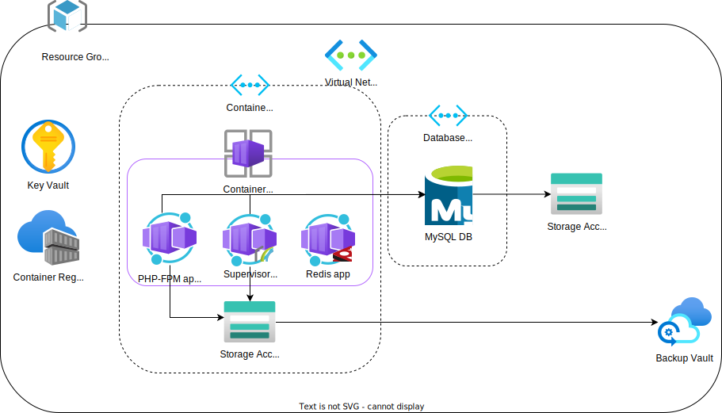

This Docker image can be used to easily provision an Azure environment to host a Pimcore solution.



## Initial provisioning

Follow these steps to provision an environment for the first time:

1. Pull the image and run it with either `docker run` or `docker-compose`. With `compose`, use something like the following:
   ```yaml
   services:
     pimcore-azure-provisioning:
        image: ghcr.io/torqit/pimcore-azure-provisioning:latest
        volumes:
           # Necessary for running Docker commands within the container
           - /var/run/docker.sock:/var/run/docker.sock
           # Volume mount in your parameter file as needed - copy this from stub.parameters.json and
           # fill in your preferred values
           - ./azure/parameters.json:/azure/parameters.json
           # You may also want to declare per-environment files like so
           - ./azure/parameters.dev.json:/azure/parameters.dev.json
           - ./azure/parameters.prod.json:/azure/parameters.prod.json
         environment:
           # These vars are required so that the scripts can properly tag and
           # push the necessary images to Azure. Ensure these images are built
           # and set the values here to match the image names (can be found by
           # running docker image ls).
           - LOCAL_PHP_FPM_IMAGE=${LOCAL_PHP_FPM_IMAGE}
           - LOCAL_SUPERVISORD_IMAGE=${LOCAL_SUPERVISORD_IMAGE}
           - LOCAL_REDIS_IMAGE=${LOCAL_REDIS_IMAGE}
   ```
2. Update `parameters.json` with the appropriate values for your Azure environment. Note that the comments present in `stub.parameters.json` will need to be removed. Note that you will also need to remove the parameters related to custom domains and certificates (see section below) for the initial provisioning.
3. Enter the container shell with `docker exec -it <container-name> bash`.
4. Run `./login-to-tenant.sh parameters.json` and follow the browser prompts to log in.
5. If a Resource Group and Service Principal have not yet been created (e.g. if you are not an Owner in the Azure tenant), run `initialize-resource-group-and-service-principal.sh parameters.json`. Once complete, note down the `appId` and `password` that are returned from the creation of the Service Principal (the app ID is the service principal ID). The service principal can then be used in your CI/CD pipeline.
6. Run `./create-key-vault.sh parameters.json` to create a Key Vault in your Resource Group. Make up a secure database password and add it as a secret to this vault using either the Azure Portal or CLI. Add any other secrets your Container App will need to this vault as well (see `stub.parameters.jsonc` for details on how to reference these).
7. Run `./provision.sh parameters.json` to provision the Azure environment.
8. Once provisioned, follow these steps to seed the database with the Pimcore schema:
   1. Make up a secure password that you will use to log into the Pimcore admin panel and save it somewhere secure such as a password manager, or within the key vault you created earlier. Note that symbols such as % and # will not work with the bash command below, so a long alphanumeric password should be used.
   2. Ensure that your PHP-FPM image contains the SSL certificate required for communicating with the database (can be downloaded from https://dl.cacerts.digicert.com/DigiCertGlobalRootCA.crt.pem). The command below assumes the file is present at `/var/www/html/config/db/DigiCertGlobalRootCA.crt.pem`.
   3. Run `az containerapp exec --resource-group <your-resource-group> --name <your-php-fpm-container-app> --command bash` to enter the Container App's shell.
   4. Run the following command to seed the database:
      ```bash
      runuser -u www-data -- vendor/bin/pimcore-install \
        --admin-username=admin \
        --admin-password=<secure admin password> \
        --mysql-host-socket=$DATABASE_HOST \
        --mysql-database=$DATABASE_NAME \
        --mysql-username=$DATABASE_USER \
        --mysql-password=$DATABASE_PASSWORD \
        --mysql-ssl-cert-path=config/db/DigiCertGlobalRootCA.crt.pem \
        --ignore-existing-config \
        --skip-database-config
      ```

## Custom domains and HTTPS certificates

Container Apps support custom domains and Azure-managed HTTPS certificates, but since they require some manual interaction with your DNS, it is best to configure them manually in your initial provisioning. Use this repository to manage these as follows:

1. For the initial provisioning, leave the `phpFpmContainerAppCustomDomains` array blank, like so:
   ```
   "phpFpmContainerAppCustomDomains": {
     "value": [
     ]
   },
   ```
2. Once your environment is provisioned, go to https://portal.azure.com and navigate to your PHP-FPM Container App.
3. In the left-hand menu, click "Custom Domains". Click "Add", select the "Managed Certificate" option, and follow the instructions for adding a custom domain to your DNS.
4. Once complete, you should be able to access your Container App at the configured custom domain, and it should be secured with HTTPS.
5. Add the custom domain and certificate to the `phpFpmContainerAppCustomDomains` parameter in your `parameters.json` file like so:
   ```
   "phpFpmContainerAppCustomDomains": {
      "value": [
         {
            "domainName": "my-domain.example.com"
            "certificateName": "my-certificate"
         }
      ]
   }
   ```
   This will ensure these settings are maintained whenever you deploy infrastructure updates. The certificate name can be found by going to the Container Apps Environment, clicking "Certificates", and copying the value in the "Friendly name" column.

## Automated backups

The provisioning script will automatically configure the following backups:

1. Point-in-time snapshots of the database. Retention of these snapshots is controlled by the `databaseBackupRetentionDays` parameter.
2. Point-in-time snapshots of the Storage Account (which contains persistent Pimcore files such as assets). Retention of these snapshots is controlled by the `storageAccountBackupRetentionDays` parameter.
3. Long-term backups of the database. As Azure Database for MySQL does not have built-in support for long-term backups, this image uses a custom solution using https://github.com/TorqIT/pimcore-database-backup-bundle to store backups in a Storage Account configured by the `databaseBackupsStorageAccount*` parameters.
4. Long-term backups of the Storage Account. The provisioning script will automatically create a Backup Vault that stores monthly backups of the containers. These backups are retained for up to one year.

Note that all backups are stored using Local Redundancy (see https://learn.microsoft.com/en-us/azure/storage/common/storage-redundancy#locally-redundant-storage for more information).

## Configuring CI/CD

See https://github.com/TorqIT/pimcore-github-actions-workflows for examples of GitHub Actions workflows that can be used to deploy to Container Apps, in particular the `container-apps-*.yml` files.

## Updating an existing environment

Bicep files are declarative, meaning that they declare the desired state of your resources. This means that you can deploy using the same files multiple times, and only the new changes that you've made will be applied. If you wish to change any resource names or properties, simply update them in your `parameters.json` file and re-run `./provision.sh parameters.json`. Keeping the `parameters.json` files committed in your source control is a good practice as it will allow you to maintain a snapshot of your environment's state.

When adding/updating/removing Container Apps secrets for the PHP-FPM container, you will need to deactivate any active revisions that are using the existing secrets (Azure will throw an error if you do not first deactivate). To deactivate the active revisions, enter this container and run `./scripts/deactivate-php-fpm-container-app-revisions.sh parameters.json`.

## Useful scripts

Once an environment has been provisioned, the `scripts/` directory contains some useful scripts that can be run against the running environment (see its [README](https://github.com/TorqIT/pimcore-azure-provisioning/blob/main/scripts/README.md)).
